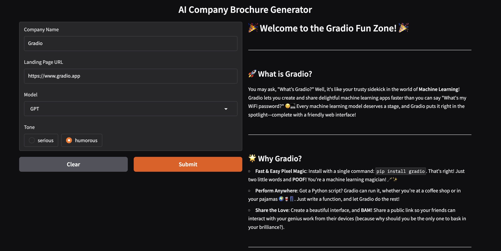

## 🧠 AI Brochure Generator

Generate professional or humorous brochures from any public company website using OpenAI, Python, and web scraping.



## ✨ Features

- Scrapes company websites to extract landing page text and relevant subpages
- Uses OpenAI (GPT-4o) and Anthropic (claude-3-haiku-20240307) to generate brochures in markdown
- Supports both **serious** and **humorous** brochure tones
- Gradio UI
- Saves the brochure as a `.md` file for easy use or publishing

---

## 🚀 Getting Started

### 1. Clone the repository

```bash
git clone https://github.com/tagaertner/AI-Brochure.git
cd AI-Brochure
```

### 2. Set up your environment (using Conda)

Create and activate a new Conda environment:

```bash
conda create -n ai-brochure python=3.11
conda activate ai-brochure
pip install -r requirements.txt

pip install openai
pip install anthropic
pip install gradio
pip install beautifulsoup4
pip install python-dotenv
pip install validators
pip install requests

```

### 3. Add your OpenAI API key

```
Create a .env file in the project root:
OPENAI_API_KEY=sk-proj-xxxxxxxxxxxxxxxxxxxxxxxx

### 💻 Running the App

Run the Gradio UI (local web app):
python3 main.py

Then open your browser to:
👉 http://127.0.0.1:7860

To share a public link, use:
gr.Interface(...).launch(share=True)

```

📝 Example Output

Serious tone:

Hugging Face is a collaborative machine learning platform trusted by companies like Google and Microsoft…

Humorous tone:

Hugging Face: Where AI meets hugs and GPUs are our love language 💻💖

## 🛠 Tech Stack

- Python 3.10+
- OpenAI API (GPT-4o)
- BeautifulSoup (HTML parsing)
- python-dotenv (environment config)
- Gradio(UI)

**MIT License Copyright (c) 2025 Tami Gaertner**
